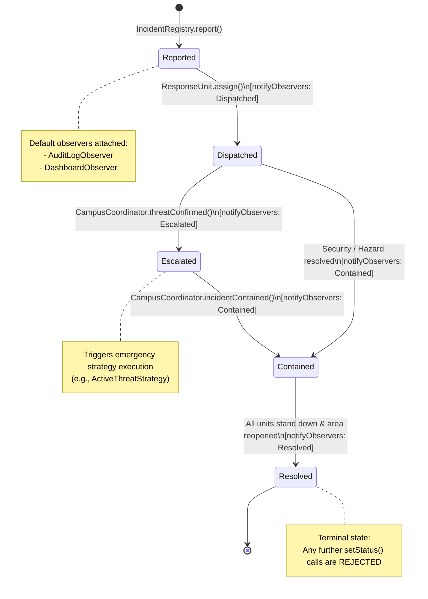
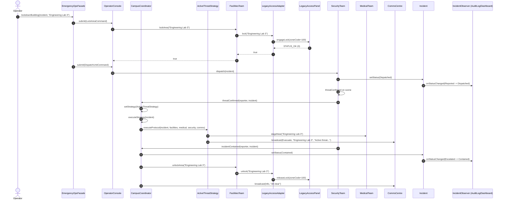
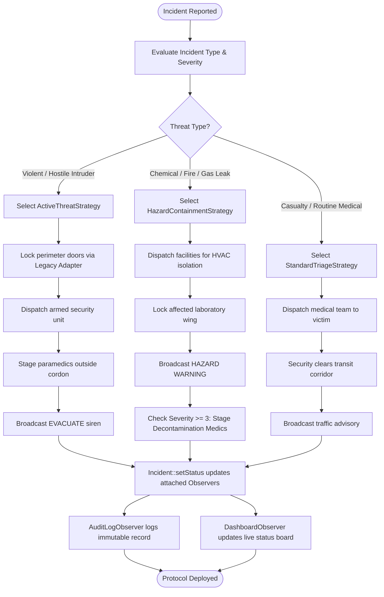

# CampusGuard Behavioural Diagrams (Observer & Strategy Patterns)

This document contains the required behavioural diagrams for Member 3's chosen patterns (**Observer** and **Strategy**), as required by **Task 4** and the **Team Work Split**.

---

## 1. Incident Lifecycle & Observer Notification (State Machine Diagram)

This state diagram depicts how an `Incident` transitions across its operational states and automatically triggers `notifyObservers(oldStatus, newStatus)` to update `AuditLogObserver` and `DashboardObserver`.

---

## 2. Emergency Strategy Execution Workflow (Sequence Diagram)

This sequence diagram illustrates how `CampusCoordinator` delegates incident handling to an `EmergencyStrategy` (`ActiveThreatStrategy`), coordinating `FacilitiesTeam` (via `LegacyAccessAdapter`), `SecurityTeam`, `MedicalTeam`, and `CommsCentre` without procedural switch statements.

---

## 3. Emergency Protocol Selection & Triage (Activity Diagram)

