# Final Complete UML Class Diagram (All 6 GoF Patterns)

This diagram unites all three members' contributions into one cohesive design, resolving the `pending 2 additional patterns` status in the team repository.

```mermaid
classDiagram
    %% =========================================================================
    %% DOMAIN & OBSERVER PATTERN (Member 3)
    %% =========================================================================
    class IncidentStatus {
        <<enumeration>>
        Reported
        Dispatched
        Escalated
        Contained
        Resolved
    }

    class IncidentType {
        <<enumeration>>
        Fire
        Medical
        SecurityThreat
        Infrastructure
    }

    class IncidentObserver {
        <<interface>>
        +~IncidentObserver()*
        +onStatusChanged(incident: const Incident&, oldStatus: IncidentStatus, newStatus: IncidentStatus)* void
    }

    class AuditLogObserver {
        -history_: vector~string~
        +onStatusChanged(incident: const Incident&, oldStatus: IncidentStatus, newStatus: IncidentStatus) void
        +history() const vector~string~&
        +printSummary() const void
    }

    class DashboardObserver {
        -terminalName_: string
        +DashboardObserver(terminalName: string)
        +onStatusChanged(incident: const Incident&, oldStatus: IncidentStatus, newStatus: IncidentStatus) void
    }

    class Incident {
        -id_: int
        -type_: IncidentType
        -location_: string
        -severity_: int
        -status_: IncidentStatus
        -observers_: vector~IncidentObserver*~
        +Incident(id: int, type: IncidentType, location: string, severity: int)
        +id() const int
        +type() const IncidentType
        +location() const string&
        +severity() const int
        +status() const IncidentStatus
        +label() const string
        +setStatus(next: IncidentStatus) bool
        +attachObserver(observer: IncidentObserver*) void
        +detachObserver(observer: IncidentObserver*) void
        +notifyObservers(oldStatus: IncidentStatus, newStatus: IncidentStatus) void
    }

    class IncidentRegistry {
        -incidents_: vector~unique_ptr~Incident~~
        -defaultObservers_: vector~IncidentObserver*~
        -nextId_: int
        +report(type: IncidentType, location: string, severity: int) Incident&
        +find(id: int) Incident*
        +registerDefaultObserver(observer: IncidentObserver*) void
    }

    IncidentObserver <|.. AuditLogObserver : implements
    IncidentObserver <|.. DashboardObserver : implements
    Incident o--> "0..*" IncidentObserver : notifies (non-owning)
    IncidentRegistry *--> "1..*" Incident : owns (unique_ptr)
    Incident --> IncidentStatus : has
    Incident --> IncidentType : has

    %% =========================================================================
    %% MEDIATOR PATTERN (Member 1)
    %% =========================================================================
    class ResponseCoordinator {
        <<interface>>
        +~ResponseCoordinator()*
        +threatConfirmed(reporter: ResponseUnit&, incident: Incident&)* void
        +casualtiesReported(reporter: ResponseUnit&, incident: Incident&)* void
        +areaAccessChanged(reporter: ResponseUnit&, area: string, locked: bool)* void
        +incidentContained(reporter: ResponseUnit&, incident: Incident&)* void
    }

    class CampusCoordinator {
        -security_: SecurityTeam&
        -medical_: MedicalTeam&
        -facilities_: FacilitiesTeam&
        -comms_: CommsCentre&
        -strategy_: EmergencyStrategy*
        +CampusCoordinator(security: SecurityTeam&, medical: MedicalTeam&, facilities: FacilitiesTeam&, comms: CommsCentre&)
        +~CampusCoordinator()
        +threatConfirmed(reporter: ResponseUnit&, incident: Incident&) void
        +casualtiesReported(reporter: ResponseUnit&, incident: Incident&) void
        +areaAccessChanged(reporter: ResponseUnit&, area: string, locked: bool) void
        +incidentContained(reporter: ResponseUnit&, incident: Incident&) void
        +setStrategy(strategy: EmergencyStrategy*) void
        +strategy() const EmergencyStrategy*
        +executeStrategy(incident: Incident&) bool
        -log(message: string) const void
    }

    class ResponseUnit {
        <<abstract>>
        -name_: string
        -coordinator_: ResponseCoordinator*
        -assignment_: Incident*
        +ResponseUnit(name: string)
        +~ResponseUnit()*
        +dispatch(incident: Incident&)* bool
        +standDown() bool
        +setCoordinator(coordinator: ResponseCoordinator*) void
        +name() const string&
        +isAvailable() const bool
        +isAssignedTo(incident: const Incident&) const bool
        #assign(incident: Incident&) bool
        #assignment() const Incident*
        #coordinator() const ResponseCoordinator*
        #log(message: string) const void
    }

    class SecurityTeam {
        +SecurityTeam(name: string)
        +dispatch(incident: Incident&) bool
        +containThreat() bool
        +clearRoute(area: string) void
    }

    class MedicalTeam {
        +MedicalTeam(name: string)
        +dispatch(incident: Incident&) bool
        +stageNear(area: string) void
    }

    class FacilitiesTeam {
        -locked_: set~string~
        -access_: AccessControlSystem*
        +FacilitiesTeam(name: string)
        +dispatch(incident: Incident&) bool
        +lockArea(area: string) bool
        +unlockArea(area: string) bool
        +isLocked(area: string) const bool
        +setAccessControl(access: AccessControlSystem&) void
    }

    ResponseCoordinator <|.. CampusCoordinator : implements
    ResponseUnit <|-- SecurityTeam : extends
    ResponseUnit <|-- MedicalTeam : extends
    ResponseUnit <|-- FacilitiesTeam : extends
    ResponseUnit o--> "0..1" ResponseCoordinator : reports to (non-owning)
    CampusCoordinator o--> "1" SecurityTeam : coordinates (reference)
    CampusCoordinator o--> "1" MedicalTeam : coordinates (reference)
    CampusCoordinator o--> "1" FacilitiesTeam : coordinates (reference)
    CampusCoordinator o--> "1" CommsCentre : directs (reference)

    %% =========================================================================
    %% STRATEGY PATTERN (Member 3)
    %% =========================================================================
    class EmergencyStrategy {
        <<interface>>
        +~EmergencyStrategy()*
        +name() const* string
        +executeProtocol(incident: Incident&, facilities: FacilitiesTeam&, medical: MedicalTeam&, security: SecurityTeam&, comms: CommsCentre&)* bool
    }

    class ActiveThreatStrategy {
        +name() const string
        +executeProtocol(incident: Incident&, facilities: FacilitiesTeam&, medical: MedicalTeam&, security: SecurityTeam&, comms: CommsCentre&) bool
    }

    class HazardContainmentStrategy {
        +name() const string
        +executeProtocol(incident: Incident&, facilities: FacilitiesTeam&, medical: MedicalTeam&, security: SecurityTeam&, comms: CommsCentre&) bool
    }

    class StandardTriageStrategy {
        +name() const string
        +executeProtocol(incident: Incident&, facilities: FacilitiesTeam&, medical: MedicalTeam&, security: SecurityTeam&, comms: CommsCentre&) bool
    }

    EmergencyStrategy <|.. ActiveThreatStrategy : implements
    EmergencyStrategy <|.. HazardContainmentStrategy : implements
    EmergencyStrategy <|.. StandardTriageStrategy : implements
    CampusCoordinator o--> "0..1" EmergencyStrategy : delegates to (non-owning)

    %% =========================================================================
    %% ADAPTER PATTERN (Member 2)
    %% =========================================================================
    class AccessControlSystem {
        <<interface>>
        +~AccessControlSystem()*
        +lock(area: string)* bool
        +unlock(area: string)* bool
        +isLocked(area: string) const* bool
    }

    class LegacyAccessPanel {
        -engagedZones: bool[256]
        +static STATUS_OK: int
        +static STATUS_ALREADY_ENGAGED: int
        +static STATUS_ALREADY_RELEASED: int
        +static STATUS_UNKNOWN_ZONE: int
        +engageLock(zoneCode: int) int
        +releaseLock(zoneCode: int) int
        +isEngaged(zoneCode: int) const bool
    }

    class LegacyAccessAdapter {
        -panel: LegacyAccessPanel&
        -zoneCodes: map~string, int~
        -nextZoneCode: int
        +LegacyAccessAdapter(panel: LegacyAccessPanel&)
        +lock(area: string) bool
        +unlock(area: string) bool
        +isLocked(area: string) const bool
        -zoneCodeFor(area: string) const int
    }

    AccessControlSystem <|.. LegacyAccessAdapter : implements
    LegacyAccessAdapter o--> "1" LegacyAccessPanel : adapts (reference)
    FacilitiesTeam o--> "0..1" AccessControlSystem : delegates door lock (non-owning)

    %% =========================================================================
    %% COMMAND PATTERN (Member 1)
    %% =========================================================================
    class OperatorCommand {
        <<interface>>
        +~OperatorCommand()*
        +execute()* bool
        +undo()* bool
        +describe() const* string
    }

    class DispatchUnitCommand {
        -unit_: ResponseUnit&
        -incident_: Incident&
        +DispatchUnitCommand(unit: ResponseUnit&, incident: Incident&)
        +execute() bool
        +undo() bool
        +describe() const string
    }

    class LockAreaCommand {
        -facilities_: FacilitiesTeam&
        -area_: string
        +LockAreaCommand(facilities: FacilitiesTeam&, area: string)
        +execute() bool
        +undo() bool
        +describe() const string
    }

    class IssueAlertCommand {
        -comms_: CommsCentre&
        -level_: AlertLevel
        -zone_: string
        -message_: string
        +IssueAlertCommand(comms: CommsCentre&, level: AlertLevel, zone: string, message: string)
        +execute() bool
        +undo() bool
        +describe() const string
    }

    class OperatorConsole {
        -operator_: string
        -history_: vector~unique_ptr~OperatorCommand~~
        +OperatorConsole(operatorName: string)
        +submit(command: unique_ptr~OperatorCommand~) bool
        +cancelLast() bool
        +historySize() const size_t
    }

    class CommsCentre {
        +broadcast(level: AlertLevel, zone: string, message: string) bool
        +retract(zone: string) bool
    }

    OperatorCommand <|.. DispatchUnitCommand : implements
    OperatorCommand <|.. LockAreaCommand : implements
    OperatorCommand <|.. IssueAlertCommand : implements
    DispatchUnitCommand o--> "1" ResponseUnit : receiver
    LockAreaCommand o--> "1" FacilitiesTeam : receiver
    IssueAlertCommand o--> "1" CommsCentre : receiver
    OperatorConsole *--> "0..*" OperatorCommand : owns history (unique_ptr)

    %% =========================================================================
    %% FACADE PATTERN (Member 2)
    %% =========================================================================
    class EmergencyOpsFacade {
        -console: OperatorConsole&
        -security: SecurityTeam&
        -facilities: FacilitiesTeam&
        -comms: CommsCentre&
        +EmergencyOpsFacade(console: OperatorConsole&, security: SecurityTeam&, facilities: FacilitiesTeam&, comms: CommsCentre&)
        +lockdownBuilding(incident: Incident&, area: string) bool
    }

    EmergencyOpsFacade o--> "1" OperatorConsole : invokes commands
    EmergencyOpsFacade o--> "1" SecurityTeam : subsystem ref
    EmergencyOpsFacade o--> "1" FacilitiesTeam : subsystem ref
    EmergencyOpsFacade o--> "1" CommsCentre : subsystem ref
```

